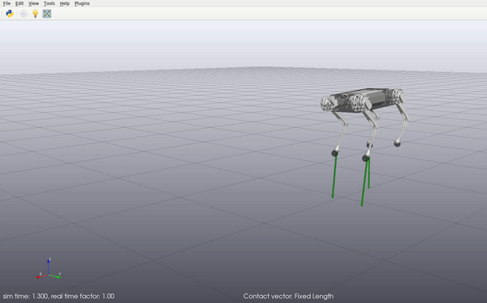

# Quadruped Drake

This repository contains code for the simulation and control of quadruped robots using [Drake](https://drake.mit.edu). This code has been modified and extended for the use in this RBE 550 Project.



## Dependencies

- [Drake](https://drake.mit.edu), compiled with Python bindings
- [LCM](https://lcm-proj.github.io/)
- [Eigen](http://eigen.tuxfamily.org/)
- [Ipopt](https://projects.coin-or.org/Ipopt)
- [ifopt](https://github.com/ethz-adrl/ifopt)
- [CMake](https://cmake.org/cmake/help/v3.0/)
- [Numpy](https://numpy.org)

## Installation

Clone this repository: `git clone https://github.com/vincekurtz/quadruped_drake.git`

Setup the build profile for conan:

``` shell
conan profile detect --force
```

Install dependencies through Conan (this create a build directory):

``` shell
conan install . --output-folder=build --build=missing
```

Configure the build:
``` shell
cd build
cmake .. -DCMAKE_TOOLCHAIN_FILE="conan_toolchain.cmake" -DCMAKE_BUILD_TYPE=Release

```

Compile C\+\+ code (includes TOWR and custom LCM bindings for interface with drake):
```
make
```